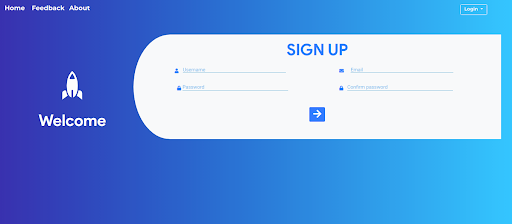
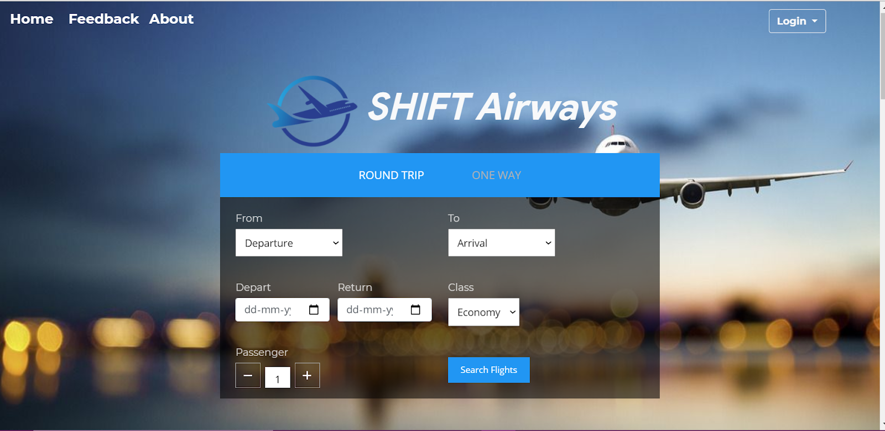
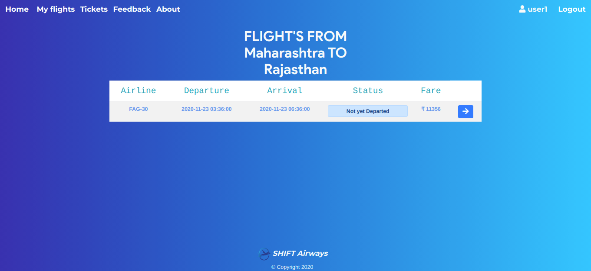
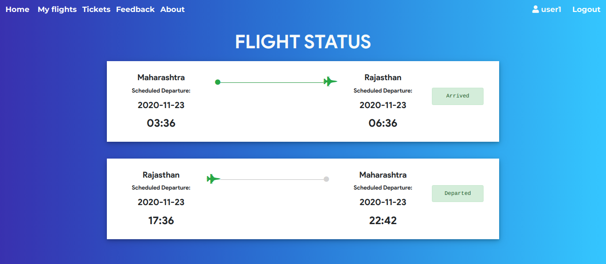
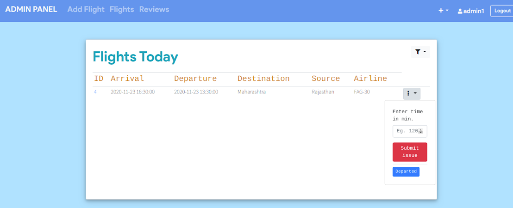
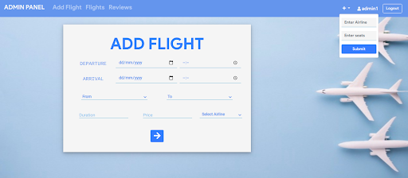

# Flight Management System

## Guide 
:exclamation::exclamation: Add your mysql server username and password (default credentials for xampp `username:'root'` and `password:''`) in file `helpers/init_conn_db.php`  
Schema of Tables is specified in file `tables.sql`

### For reseting the password, authentication is email based if you want don't want that just comment it out else just add your email credentials in the file `includes/reset-request.inc.php`

## Screen Shots

